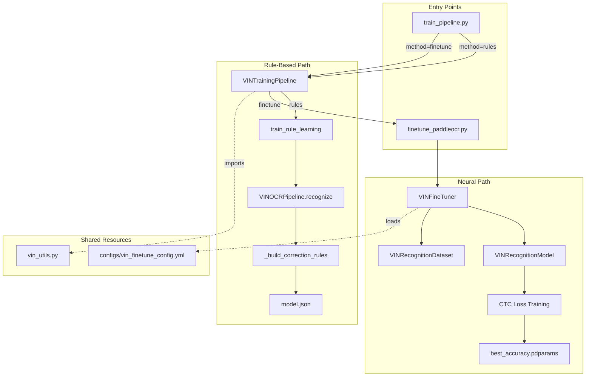
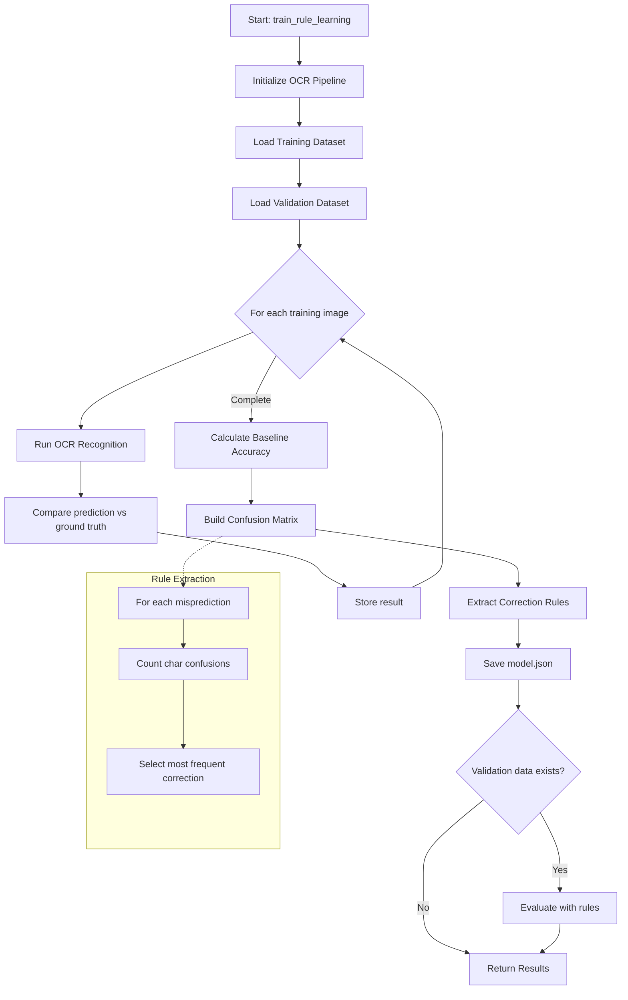
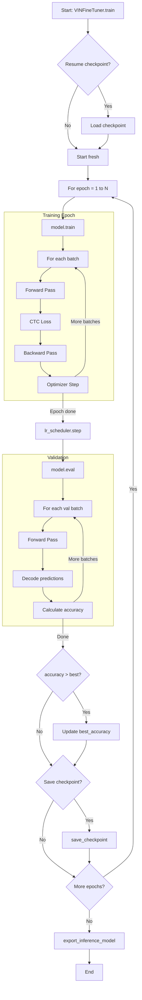
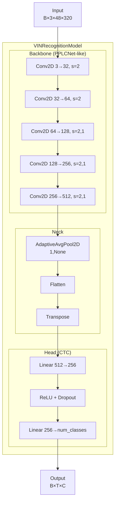
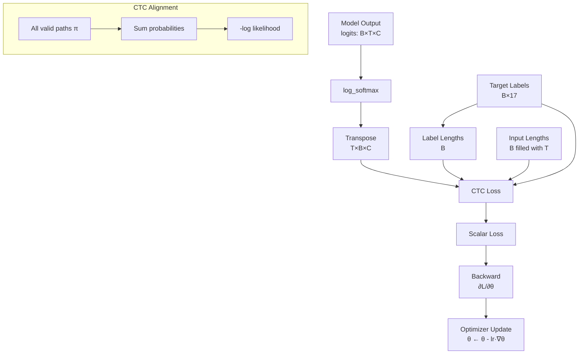
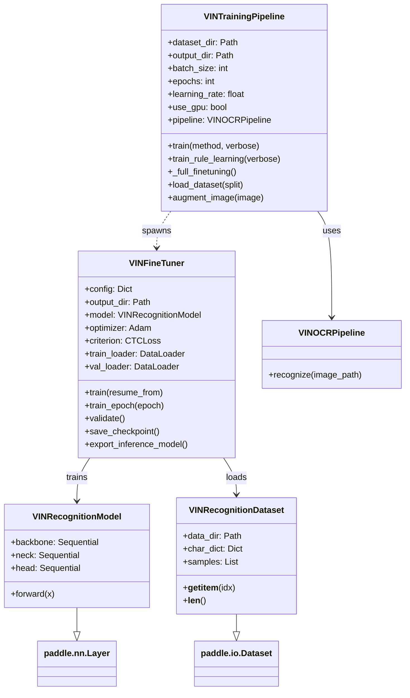
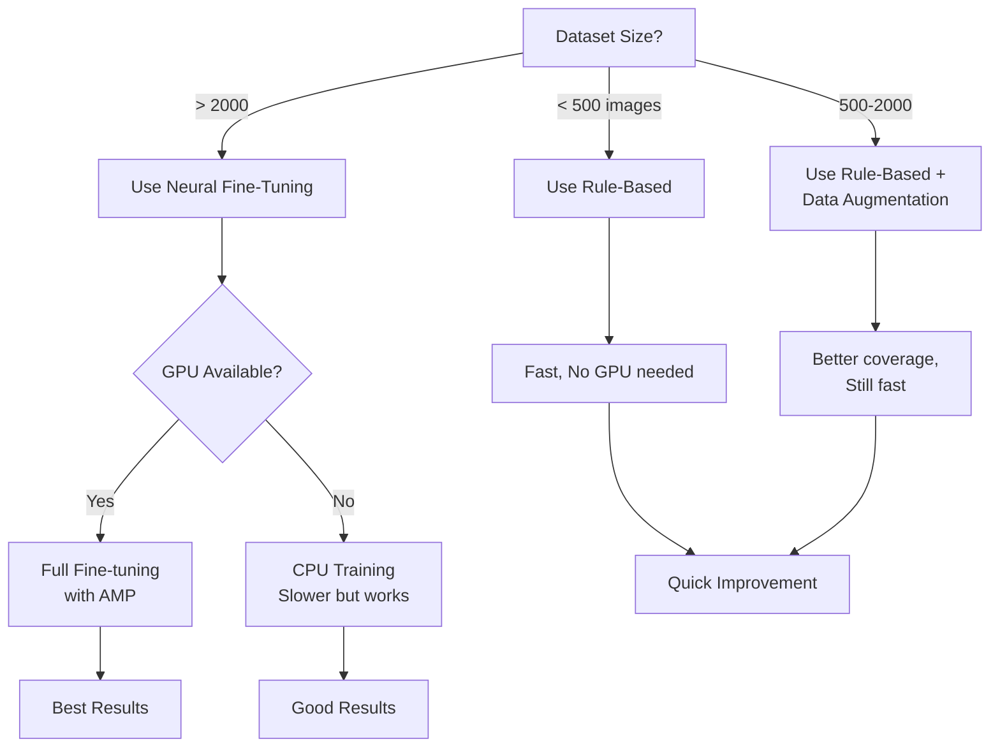
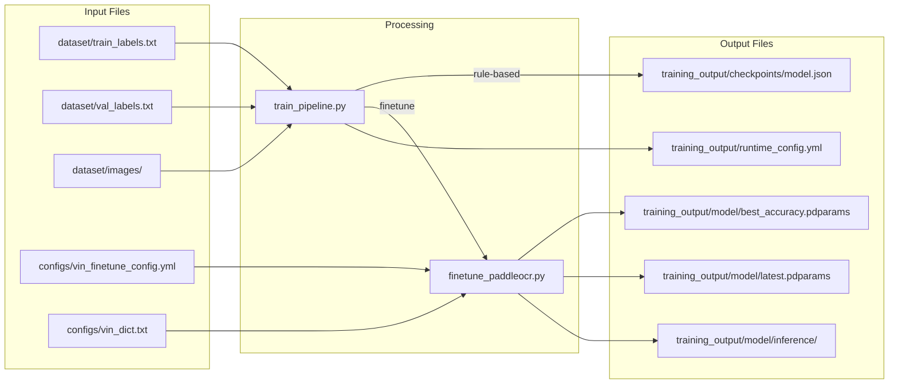
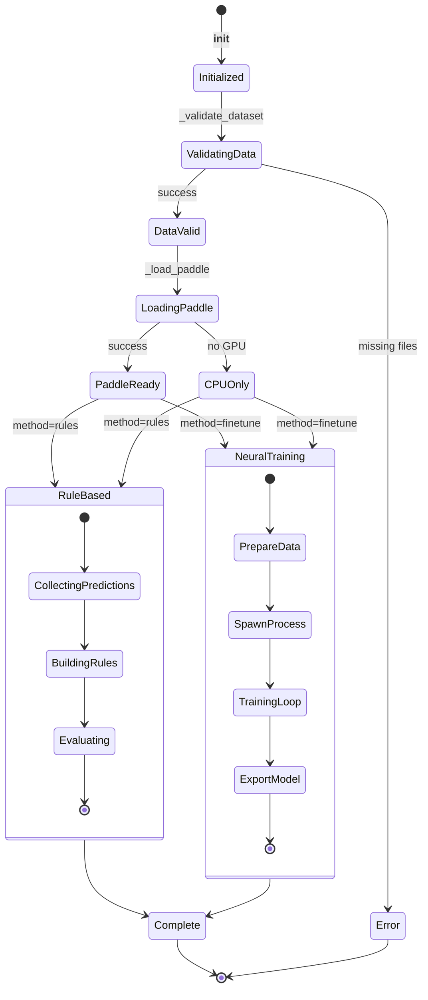

# VIN OCR Training: Control Flow Diagrams (Mermaid)

This document contains Mermaid diagrams for visualizing the training pipeline control flow.

## 1. System Architecture



## 2. Rule-Based Learning Flow



## 3. Neural Fine-Tuning Flow



## 4. Data Processing Pipeline

```mermaid
flowchart LR
    subgraph "Input"
        I1[Raw Image<br/>H×W×3]
        I2[VIN Label<br/>'ABC123...']
    end
    
    subgraph "Image Processing"
        P1[Resize<br/>48×320]
        P2[Normalize<br/>[-1,1]]
        P3[Augment<br/>optional]
        P4[HWC→CHW]
    end
    
    subgraph "Label Processing"
        L1[Char to Index<br/>Encoding]
        L2[Pad to<br/>max_length]
    end
    
    subgraph "DataLoader"
        D1[Batch<br/>images]
        D2[Batch<br/>labels]
        D3[lengths]
    end
    
    I1 --> P1 --> P2 --> P3 --> P4 --> D1
    I2 --> L1 --> L2 --> D2
    L2 --> D3
```

## 5. Model Architecture



## 6. CTC Loss Computation



## 7. Class Dependency Graph



## 8. Training Method Decision Tree



## 9. File I/O Dependencies



## 10. State Machine: Training Lifecycle



---

## Usage

To render these diagrams:
1. Use a Markdown viewer with Mermaid support (VS Code with Mermaid extension, GitHub, etc.)
2. Paste into [Mermaid Live Editor](https://mermaid.live/)
3. Export as PNG/SVG for documentation

## Quick Reference

| Diagram | Purpose |
|---------|---------|
| System Architecture | High-level component relationships |
| Rule-Based Flow | Step-by-step rule learning process |
| Neural Fine-Tuning Flow | Complete training loop |
| Data Processing | Image and label preprocessing |
| Model Architecture | Neural network structure |
| CTC Loss | Loss computation details |
| Class Dependency | OOP relationships |
| Decision Tree | When to use which method |
| File I/O | Input/output file mapping |
| State Machine | Training lifecycle states |
