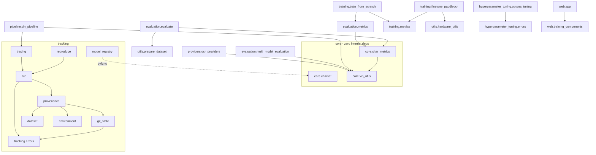
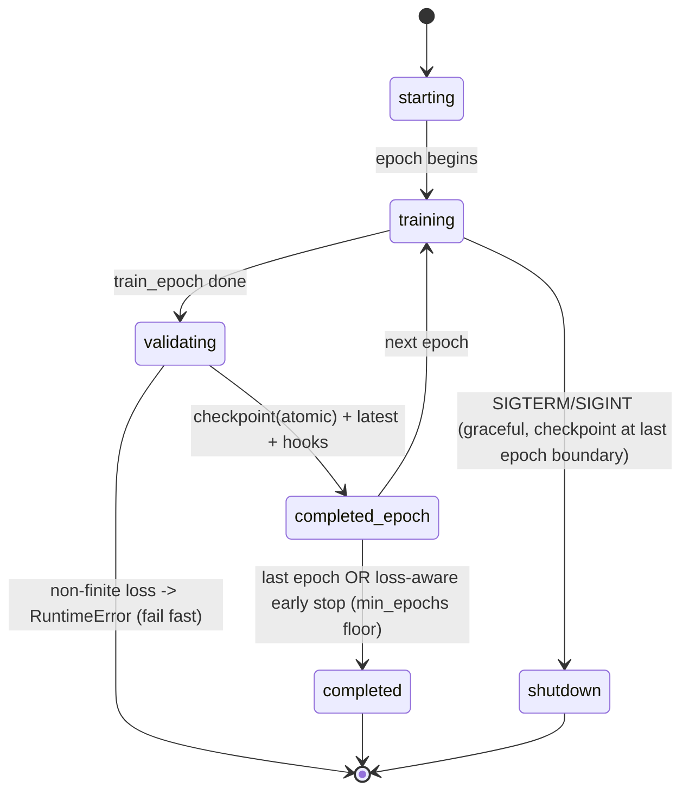

# System Maps — measured, regenerable (2026-08-19, HEAD post-3d42679)

Credibility rule for this document: **every graph below is generated from
the code or measured at runtime — none is drawn from belief.** Sections
1-3 and 5 are produced by `scripts/generate_system_maps.py` (re-run it and
diff after structural changes); coverage numbers come from
`pytest --cov=src`; sequence and threat sections cite file:line for every
claim. Where static analysis has limits, the limits are stated.

---

## 1. Module Dependency Graph (architecture · directed)

Generated from AST import analysis over all 51 modules in `src/vin_ocr`.
**45 internal edges, 0 cycles** — the import graph is a DAG (Power-of-10
Rule 1 at architecture level holds).



**Version/decoupling facts (measured):**

| Highest fan-in (the load-bearing modules) | fan-in |
|---|---|
| `core.vin_utils` (VIN domain: checksum, extraction, artifact rule) | 4 |
| `tracking.errors`, `tracking.git_state` | 4 |
| `utils.hardware_utils`, `tracking.run` | 3 |

- The single-source-of-truth modules (`core.charset`, `core.vin_utils`,
  `core.char_metrics`) have **zero internal dependencies** — they can
  never participate in a cycle, and every consumer imports the ONE
  definition (enforced further by identity tests in the suite).
- Package pinning: core deps in `[project.dependencies]`
  (paddlepaddle>=3.0, paddleocr>=2.9); optional capability extras
  decouple web/training/tracking/onnx (`mlflow>=3.1` required for
  LoggedModel+tracing). Known gap: CI installs a paddle-less subset, so
  paddle-marked tests never run there (readiness item C8).

## 2. Cyclomatic / Control-Flow Census × Test Coverage (logic · CFG)

Measured over **639 functions**: mean cyclomatic **5.09**, 74 functions
over the ≤10 ceiling, 135 over 50 lines. Coverage measured by
`pytest --cov=src`: **29.9% overall** (3,152/10,558 lines) — the suite is
deep on the measurement core and absent on UI/CLI shells.

**Risk quadrant (high complexity × low coverage) — the honest hot list:**

| Function | cyc | lines | module coverage |
|---|---|---|---|
| `web.app.render_data_management_page` | 60 | 326 | ~0% (web/app.py) |
| `web.app.render_results_dashboard` | 55 | 240 | ~0% |
| `web.app.render_system_health` | 46 | 214 | ~0% |
| `finetune_paddleocr._calculate_detailed_metrics` | 39 | 160 | partial (metrics path tested via canonical delegation) |
| `providers._weighted_char_vote_strategy` | 34 | 123 | covered (ensemble tests) |
| `web.training_components._monitor_process` | 26 | 117 | ~0% |

Well-covered anchors: `core/*` (charset, vin_utils, char_metrics),
`tracking/errors+run` (provenance suite), `evaluation` honesty layers —
i.e. **coverage concentrates exactly where the numbers are produced**,
which is the correct priority; the untested mass is Streamlit rendering
and CLI arg-shells. Regenerate: sections 2 numbers via the script; the
0% list via `pytest --cov=src --cov-report=term-missing`.

## 3. Call Graph / Dead-Code Candidates (execution · directed)

Static name-based reachability from the 9 real entry points (console
scripts + module mains), with dispatch-table strings and test usage
counted as uses. **Stated limit:** dynamic dispatch (`getattr`, framework
callbacks) can make a live function look dead — these are candidates for
review, not verdicts, and framework hooks (`on_*`, `load_context`,
`predict`) plus API surface used only from docs are expected hits.

52 candidates. Triaged:

- **Plausibly genuinely dead** (duplicated accessors across
  `utils.gpu_utils` vs `utils.hardware_utils` — the same accessor pair
  exists in both; one family is unreachable): `gpu_utils.get_torch_device`,
  `get_summary_string`, `get_status_dict`, `set_paddle_device`,
  `get_training_recommendations` (also duplicated in
  `training_components`), `hardware_utils.can_use_quantization`.
- **Dead-but-planned API surface** (exported, never called in-repo):
  `vin_utils.export_rules/from_exported/learn_from_errors`,
  `evaluation.metrics.save_history/load_metrics_from_json`,
  `tuner.get_trial_history/visualize`, `tracking.run.log_dict`.
- **False positives by construction**: `model_registry.register_checkpoint_version`
  / `traced_recognize` (invoked operationally, documented in runbook),
  HF `TrainerCallback.on_*` hooks, `training_components.start_*` (called
  from Streamlit UI strings), `pause`, `reset_shutdown_flag`.

Optimization note (measured during the sweeps): the runtime hot path is
per-image preprocessing (CLAHE at 3x target width) — epoch time is
dominated by the dataloader, not the network, on CPU (~1.2s/batch of 16).

## 4. Sequence Diagrams (interaction · timeline)

Grounded in the instrumented spans (traces `tr-4bd38ad0`, `tr-a24f7bb2`)
and the tracked-run wrapper (`_run_tracked`, finetune_paddleocr).

**Recognition request (traced path):**

```mermaid
sequenceDiagram
  participant U as CLI (vin-ocr recognize)
  participant T as tracking.tracing
  participant P as VINOCRPipeline
  participant E as PaddleOCR engine
  participant PP as VINPostProcessor
  participant M as MLflow (sqlite:///mlflow.db)
  U->>T: enable_tracing() [entry point; --no-trace opts out]
  U->>P: recognize(image) [span CHAIN]
  P->>P: preprocess (CLAHE/morphology)
  P->>E: _run_ocr_engine(processed) [span TOOL]
  E-->>P: raw text + confidence
  P->>PP: process(raw) [span PARSER: strip -> I/O/Q -> window -> checksum-gated fixes]
  PP-->>P: {vin, checksum_valid, corrections}
  P-->>U: result dict (error key on internal failure)
  P--)M: trace exported async (spans, inputs/outputs, timings)
```

**Training run (provenance + curves):**

```mermaid
sequenceDiagram
  participant CLI as vin-train finetune
  participant TR as tracking.run.start_run
  participant G as git/env/dataset capture
  participant F as VINFineTuner
  participant M as MLflow
  CLI->>TR: start_run(params, dataset_roots)
  TR->>G: capture_provenance() BEFORE run creation
  TR->>M: create run + log commit/diff/deps/fingerprints
  CLI->>F: train()
  loop each epoch
    F->>F: train_epoch -> validate
    F->>F: best_val_loss / best_accuracy checkpoints (atomic)
    F--)M: epoch_hook: train/val loss, exact, lr [step=epoch]
    F->>F: _save_latest(epoch) + latest_info.json
  end
  F->>F: export (jit; on failure: CLEANED weights-only fallback)
  CLI->>M: final metrics + artifacts + reproduce command
```

Cross-service edges (the only network calls in the system): DagsHub
(dataset pull via bearer-token HTTPS; DVC S3 gateway) and the local
MLflow SQLite store (no server required; UI optional on 127.0.0.1:5001).

## 5. State Machines (lifecycle · finite automata)

**Training-run lifecycle** — states extracted by the generator from the
literal `_save_progress(...)` status strings in the trainer (line-anchored,
so drift is detectable):



Hardening notes (each transition is guarded in code): non-finite loss
raises at all 4 accumulation sites; early stop cannot fire before
`min_epochs`; `latest` + resume info written every epoch atomically, so
every state is re-enterable via `--resume`.

**Optuna trial lifecycle** (both tuners): `RUNNING -> COMPLETE(value)` |
`FAILED(TrialExecutionError - absence of measurement, excluded from the
sampler)` — crashes can no longer masquerade as `COMPLETE(0.0)` or
`PRUNED`.

**Model-version lifecycle**: checkpoint -> `evaluate_checkpoint()`
(measured on named dataset; architecture-mismatch REJECTS) ->
LoggedModel(pyfunc: weights+config+charset+canonical decode) -> registry
version with provenance tags -> (deploy/compare). No version exists
without a measurement.

## 6. Threat Model (security · network topology)

Topology (measured, not assumed): **no listening services by default.**
Optional local listeners: MLflow UI `127.0.0.1:5001` (localhost-only
middleware), Streamlit `:8501` (LAN-exposed if launched). Egress:
`dagshub.com` only (HTTPS bearer / S3 gateway).

| # | Vector | Where (evidence) | Risk | Mitigation state |
|---|---|---|---|---|
| T1 | **Credential leakage** (DagsHub token) | `.env`, `~/Library/Caches/dagshub/tokens`, `.dvc/config.local` | High impact | `.env`+`config.local` gitignored; a previously COMMITTED credential file was purged in `ff09005`; secrets scan in CI + guardrails scans on diffs. Residual: token grants repo-wide scope — rotate on suspicion |
| T2 | **Deserialization RCE** — `paddle.load` on checkpoints; CloudPickle in registry pyfunc (mlflow's own warning) | `finetune_paddleocr.load_checkpoint`, `model_registry` | High if artifacts untrusted | Policy: only load checkpoints/models from this repo's own runs or the registry; never `--resume`/serve third-party `.pdparams`. Registry rejects architecture-mismatched checkpoints (fails before serving) |
| T3 | **Malicious images** (cv2/PIL parsing of untrusted files) | pipeline/dataset ingestion | Medium | Unreadable images raise/skip (bounded, 5% abort); keep opencv patched (`>=4.8`); no EXIF/metadata execution paths in use |
| T4 | **Web UI subprocess launching** (training commands assembled from UI config) | `training_components.start_*` (`subprocess.Popen(cmd_list)`) | Medium | List-form argv (no shell=True) blocks classic injection; paths validated + PID-locked single-run; UI binds locally by default — do NOT expose 8501 unauthenticated |
| T5 | **MLflow store poisoning** (SQLite writable by any local process) | `mlflow.db` | Low (local trust) | Localhost-only UI; provenance fields (commit+diff+fingerprints) make tampered runs detectable on replay via `vin-reproduce` |
| T6 | **Supply chain** | paddlepaddle/paddleocr wheels, dagshub client | Medium | Versions floored in pyproject; CI secrets-scan job; gap: no lockfile/hash-pinning (`uv lock` recommended) |
| T7 | **Data poisoning** (upstream dataset) | DagsHub `jlr-vin-ocr` | Medium | Triple ground-truth gate at ingest (label∩filename∩checksum, 100% pass measured); VIN-grouped split gate raises on leakage; residual: shared-source label swaps undetectable without human review (documented) |

---

*Regeneration:* `.venv/bin/python scripts/generate_system_maps.py` +
`pytest --cov=src`. If the output disagrees with this document, the
document is wrong — update it from the measurement, never the reverse.
